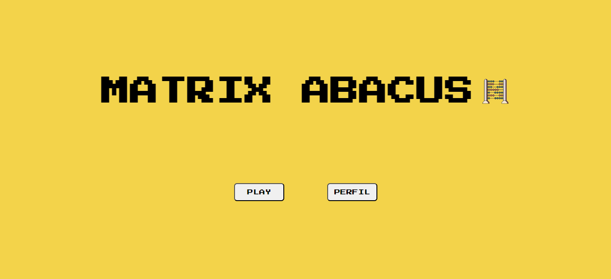

# Matrix Abacus
A tool to make matrix calculus more visual and easier :abacus:

-- todo [add gif of matrix calculator working]

## Description and goals
This web app purpose is to suport and estimulate the students of mathematics subjects to work/play with matrices and their interesting and usefull operations. And how to do that? Giving them a cool, dinamic and gamelike tool that helps them to focus on the subjects at hand, without that never ending matrices writing and rewriting.   

## User-Guide
- tutorial on how to use the matrix abacus; -- todo

## Tools :wrench: :toolbox: :
- [X] Design: Figma;
- [ ] Front-end: HTML, CSS and JavaScript; -- work currently in progress
- [ ] Back-end: Kotlin with Spring Framework.

## Screen's design
-  [Figma Project](https://www.figma.com/file/jVJbsLhrX9q2V7FhVOsOks/Matrix-Abacus?type=design&node-id=0%3A1&mode=design&t=mQp1j4m9t0UD5Aec-1)

- Landing page: 
- add more screens pics -- todo 

## Docs

### Development documentation
- links to a web documention -- work currently in progress

### Academic reports
- [x] Partial report with first screens and the main goals of the application;
- [ ] Partial report descriving front-end development; -- work currently in progress
- [ ] Final report with adding details about back-end development.
